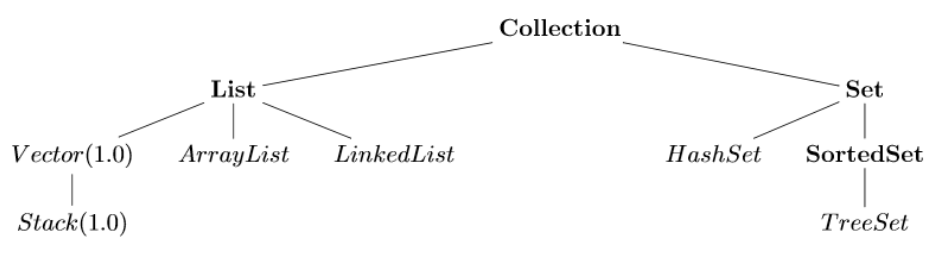
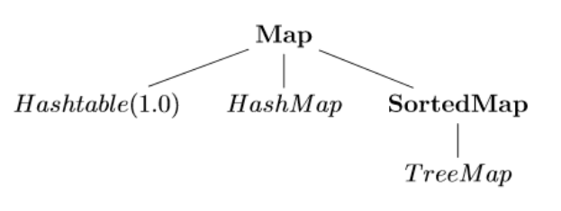
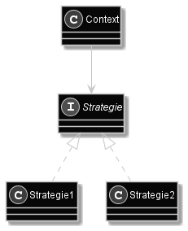
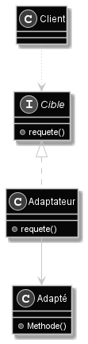
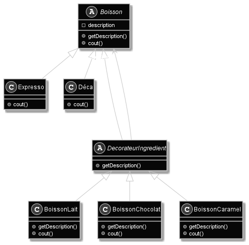
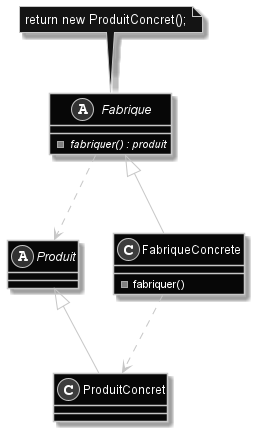

# CPOA

[Retour à l'accueil](./../README.md)

Collections, patrons de conception.

<details>
<summary> Plan ✨</summary>

- [CPOA](#cpoa)
- [Collections de java.util](#collections-de-javautil)
	- [List\<E\>](#liste)
		- [ArrayList\<E\>](#arrayliste)
		- [LinkedList\<E\> - listes doublement chaînées](#linkedliste---listes-doublement-chaînées)
		- [Vector\<E\>](#vectore)
		- [Stack\<E\> - Piles](#stacke---piles)
	- [Set](#set)
		- [HashSet - valeur→clé](#hashset---valeurclé)
		- [*SortedSet* ◦ TreeSet\<E\>](#sortedset--treesete)
	- [Itérateurs](#itérateurs)
	- [Map<K,V>](#mapkv)
		- [HashMap<K,V>](#hashmapkv)
		- [*SortedMap* ◦ TreeMap<K,V>](#sortedmap--treemapkv)
	- [classe Collections](#classe-collections)
- [Patrons de conception](#patrons-de-conception)
	- [Patron stratégie (comportement)](#patron-stratégie-comportement)
	- [Patron adapter (structure)](#patron-adapter-structure)
	- [Patron itérateur (comportement)](#patron-itérateur-comportement)
	- [Patron décorateur](#patron-décorateur)
	- [Patron fabrique (conception)](#patron-fabrique-conception)
	- [Patron fabrique abstraite](#patron-fabrique-abstraite)
	- [Patron singleton](#patron-singleton)
	- [Threads](#threads)
</details>

___
> ## Conventions de notation
> - noms de méthodes : **verbes**.
> - chaque fichier possède une **Javadoc** complète.
> - **commenter l'intérieur des méthodes** complexes.
> - **limiter le nombre de méthodes** par classe.
> - pas plus de **5 attributs** par classe.
> - pas plus de **30 lignes** par méthode.
> - pas plus de **4 boucles imbriquées**.
> - pas de **duplication de code**. Utiliser le [patron stratégie](#patron-stratégie).


___
# Collections de java.util



> ❗ Les collections ne manipulent que des objets héritant de `Object`. Elles ne prennent pas les types de base java.  
> - Il faut utiliser les objets `Wrapper` (Integer, Boolean, Double, ...).  
> - Les types de base possèdent une méthode `typeValue()` qui retourne le Wrapper de l'objet.
> - Java passe automatiquement des wrappers aux types de base et inversement.

> **Généricité :** Permet à une classe d'accepter tous types d'objets. 
> ```java
> public class Generique<E>{}
> Generique<Integer> i;
> ```

> **Raw type :** Quand on ne spécifie pas le type d'une classe générique, la classe accepte n'importe quel `Object`.  
> `get()` retourne un `Object` qu'il faut caster au bon type.

```java
interface Collection<E> {
	add(e);
	AddAll(Collection<E>);
	clear();
	contains(Object);
	containsAll(Collection<E>);
	hashCode();
	iterator();
	isEmpty();
	remove(Object);
	removeAll(Collection<E>); //enleve ce qui est en commun
	size();
	toArray();
}
```

## List\<E\>
Représente des éléments ordonnés.
```java
// Méthodes qui ne sont pas déjà dans Collection.
interface List<E> implements Collection<E> {
	add(i, E); //décale et ajoute.
	set(i, E); //remplace.
	addAll(i, Collection<E>);
	get(i);
	indexOf(Object); // utilise equals()
	lastIndexOf(Object); // utilise equals()
	listIterator([i]); //i (optionnel) : indice de départ
	remove(i); // utilise equals()
	sort(Comparator);
	subList(from, to); //from inclus, to exclus.
}
```

### ArrayList\<E\>
```java
// Méthodes qui ne sont pas déjà dans List et Collection.
class ArrayList<E> {
	ArrayList(taille ou collectionInit);
	clone(); // ArrayList implements Clonable
	forEach((x) -> /*action sur x*/);
}
```

### LinkedList\<E\> - listes doublement chaînées
```java
// Méthodes qui ne sont pas déjà dans List et Collection.
class LinkedList<E> {
	LinkedList([collectionInit]);
	addFirst(E);
	addLast(E); // <=> add(E)
	clone();
	descendingIterator();
	getFirst();
	getLast();
	removeLast();
	removeFirst(); // <=> remove()
}
```

### Vector\<E\>
Similaire à ArrayList.

### Stack\<E\> - Piles
```java
class Stack<E> extend Vector {
	push(E); //empile E
	pop(); //retourne le sommet et dépile
	peek(); //retourne le sommet
	empty(); //retourne si la pile est vide
}
```

## Set
Représente des éléments uniques.
Si on `add(j)` alors que i est dans la liste et que `i.equals(j)`, j ne sera pas ajouté. Aucune erreur n'apparait.

### HashSet - valeur→clé

```java
// Méthodes qui ne sont pas déjà dans Set et Collection.
class HashSet<E> {
	HashSet();
	HashSet(Collection<E>);
	HashSet(taille, [loadFactor]);
}
```

### *SortedSet* ◦ TreeSet\<E\>
Cette classe nécessite `compareTo(o)`, car elle représente un ensemble d'éléments ordonnés.  
❗ Pour utiliser `TreeSet<Classe>` il faut que `Classe implements Comparable`.  
Bien sûr, TreeSet ne permet pas d'ajouter deux fois la même valeur.

```java
// Méthodes qui ne sont pas déjà dans Set et Collection.
class TreeSet<E> implements SortedSet<E> {
	TreeSet();
	TreeSet(Collection<E>);
	TreeSet(Comparator<E>);
	TreeSet(SortedSet<E>);
	comparator();
	descendingIterator();
	descendingSet();
	first();
	last();
	ceiling(E); //element >=
	higher(E); //element >
	floor(E); //element <=
	lower(E); //element <
	subSet(E from, E to)
}
```


## Itérateurs
Les itérateurs permettent de parcourir une Collection élément par élément.
```java
Collection<Integer> maCollection;
Iterator<Integer> i = maCollection.iterator();
while(i.hasNext()) {
	System.out.println(i.next());
}
```
**ListIterator** permet de parcourir la liste dans les deux sens et de changer le sens pendant le parcours.  
```java
while(i.hasPrevious()) {
	System.out.println(i.previous());
}
```
On peut aussi utiliser la boucle **foreach** avec un tableau ou une instance d'Iterable (les collections par exemple).

## Map<K,V> 
  
Permet d'associer des valeurs à des clés comme dans un dictionnaire.

```java
interface Map<E> {
	put(K,V);
	get(K);
	remove(K);
	containsKey(K);
	containsValue(V);
	keySet(); // set des clés
	values(); // set des valeurs
	entrySet(); // set double :getKey(), getValue().
}
```

### HashMap<K,V>  
```java
class HashMap<E> {
	HashMap();
	HashMap(cap);
	HashMap(cap, load); //cap*2 quand (load)% de la table est atteint.
	clone();
}
```

- **hashCode()** (nécessaire) : génère K à partir de V
- **equals()** (nécessaire) : permet de savoir la position dans la table. Deux éléments égaux doivent avoir le même hashCode.


### *SortedMap* ◦ TreeMap<K,V>
```java
class TreeMap<E> {
	TreeMap();
	TreeMap(Comparator);
	TreeMap(Map);
	TreeMap(SortedMap);

}
```

## classe Collections
Algorithmes génériques opérant sur certaines collections (souvent des listes).
- sort (List<T> [Comparator<T>]) tri avec compareTo de Comparable (ou de comparator si il est fourni).
- reverse(List<T>) 
- fill(List<T>, T)
- copy(List<T> dest, List<T> src)


# Patrons de conception
Bonnes pratiques de la COO.
Solutions de haut niveau : s'adaptent à tous les languages.
Types de patrons de conception :
- patrons de **construction** (créer/configurer des objets)
- patrons de **structure** (créer des structures)
- patrons de **comportement** (gérer les interactions entre objets)


## Patron stratégie (comportement)

Le patron de conception **Stratégie** permet à une classe `Context` de switcher d'algorithme entre `Strat1` et `Strat2` en encapsulant ces deux classes dans une classe/interface `Stratégie`.

## Patron adapter (structure)

- Une classe sert d'**adaptateur** entre le client et les classes à adapter.
- L'adaptateur peut se lier aux classes à adapter par 2 moyens :
  - Extends les classes à adapter
  - Prendre les classes à adapter en paramètre

> Le client envoie `requete()` et l’adapté doit exécuter `methode()`
pour satisfaire la demande. L’adaptateur répond à cette
requête en utilisant une instance d’Adapte `(adapte.method())`.

## Patron itérateur (comportement)
- L'itérateur fournit un objet qui permet de parcourir toute Collection indépendamment de sa structure.

4 Opérations :
- `premier()`
- `suivant()`
- `termine()` : booléen vrai si on est à la fin
- `elementCourant()` : dans Java, cette méthode est dans `suivant()`.


## Patron décorateur



> **Agrégations UML :** Quand une classe 1 est composée d'objets d'une classe 2. Losange vide.

> **Composition UML :** Agrégation plus forte : quand on détruit un objet de la classe 1, tous les sous-objets sont détruits. Losange plein.

Un décorateur enveloppe une classe décorée en lui ajoutant des méthodes.
Le constructeur du décorateur prends une instance du décoré en paramètre. Le décoré est agrégé dans le décorateur.
```java
Décorateur d = new Décorateur(new Décoré());
```

## Patron fabrique (conception)


On utilise la méthode fabriquer() d'une classe Fabrique qui retourne un nouveau produit. On peut avoir plusieurs classe Fabrique qui implémentent une interface générale de fabrique.

On peut aussi utiliser des fabriques paramétrées

## Patron fabrique abstraite
Pour une seule fabrique, on va pourvoir créer plusieurs types d'objets. Une Fabrique abstraite est implémentée par plusieurs fabriques concrètes.

## Patron singleton

Garantis qu'une classe n'a qu'une seule instance accessible.
Une classe instance possède un attribut instance et une méthode statique getInstance.
```java
public class Singleton {
	private static Singleton instance;
	private Singleton(){}
	public static Singleton getInstance() {
		if(instance==null) instance = new Singleton();
		return instance;
	}
}
```

Pour garantir l'unicité de l'instance parmi les threads, on initialise l'instance dès le début : `private static Singleton instance = new Singleton`.

Mais la meilleure méthode est d'ajouter le paramètre `synchronized` à `getInstance()` qui garde l'accès à la méthode synchronisé entre les threads.

## Threads
Sur des processeurs multi coeurs, les threads s'effectuent en même temps si il y a assez de coeurs disponibles.
Sur des processeurs à un coeur, le simultané est simulé par le processeur qui change de thread 
- `run()` démarre le thread
- `start()` exécute `run()`
- `sleep(ms)` permet de mettre en pause l'exécution du thread. 